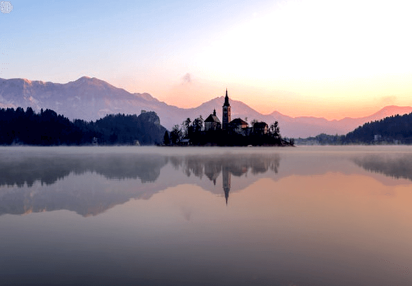

# Contrast Limited Adaptive Histogram Equalization (CLAHE)
enhancing image contrast and brightness through a classical image processing approach.

*Works on both RGB and GRAY scale PNG images*

## Before vs After

| Original | CLAHE Enhanced |
|----------|----------------|
|  |  |
|  |  |
|  |  |

## Features

- CLAHE for **grayscale** images  
- CLAHE for **RGB** images (applied on each channel separately or with blending)  
- Contrast clipping support  
- Bilinear interpolation for smooth transition between tiles  
- Alpha blending between equalized and original values (for RGB only)  
- Png images support *implemented using STB image read/write (`stb_image`, `stb_image_write`)*

## How to Use

1. Provide PNG image tou want enhanced: *load_png(image path)*
2. Call *clahe(...)* function with the right paramaters — it will enhance the image where you can save to enjoy it using *save_png(path, img)*.


## How It Works

### Step 1: Tile Division
Divide the image into square tiles of size **M × M**.  
- `M` is a user-defined parameter (e.g., 64, 128).

---

### Step 2: Histogram & Clipping
For each tile and for each color channel:
- Compute the histogram.
- Apply **clipping**:  
  Clip any bin value above a clip limit and accumulate the **total excess**.  
  - **Clip limit** = (tile width × tile height) / **clip factor**
  - **Clip factor** is a user-defined parameter.

---

### Step 3: Redistribute Excess
- Distribute the **total excess** equally across all 256 bins:
  - `excess per bin = total excess / 256`
- Add this redistributed excess to the original (clipped) histogram bins.

---

### Step 4: Cumulative Distribution Function (CDF)
- Calculate the **cumulative distribution** from the histogram:
  ```
  c(0) = H(0) / N  
  c(i) = c(i-1) + H(i) / N
  ```
  where `N = tile width × tile height`

---

### Step 5: Histogram Equalization
Apply a blend of the equalized value and the original intensity:
  ```
  HE(i) = alpha * c(i) * 255 + (1 - alpha) * i
  ```
- `alpha` is the **blend** parameter in range [0.0, 1.0]  
  - 1.0 = full equalization  
  - 0.0 = original image

---

### Step 6: Interpolation
To avoid visible borders between tiles, interpolate the result for each pixel from the 4 surrounding tiles using bilinear interpolation:

```
y
↑
|   (0,1)          (1,1)
|    HE10         HE11
|      +------------+
|      |            |
|      |   (fx,fy)  |
|      |            |
|      +------------+
|   (0,0)          (1,0)
|    HE00         HE01
+------------------------→ x

P[i] =
  (1 - fx) * (1 - fy) * HE00[i] +
  fx * (1 - fy) * HE01[i] +
  (1 - fx) * fy * HE10[i] +
  fx * fy * HE11[i];
```

---

### Step 7: Done
Enjoy the adaptively equalized image with improved contrast and brightness :)

---

## Parameters to Tune

| Parameter     | Description                                 |
|---------------|---------------------------------------------|
| Tile Size `M` | Size of each square tile                    |
| Clip Factor   | Lower = more aggressive clipping            |
| Alpha         | Blend between original and equalized image |

---

*Developed by Mohammed Yasser Mohammed* 

*email : es-mohamed.yasser2027@alexu.edu.eg* 

